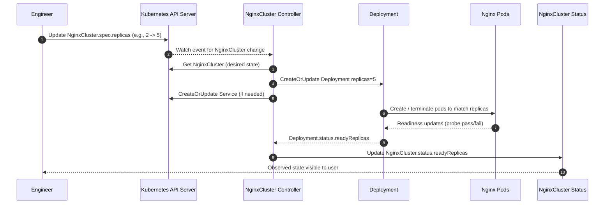

# Deepak Interview Follow-up: Operator Design, Answer, and Quick Test Guide

Prepared by: Narendra Bedarkar  
Project: `nginx-operator`

---

## 1) What Deepak's Operator Question Was Evaluating

Deepak's question ("If a CR spec change takes 10 minutes, what will you look for?") evaluates:

- Operator internals understanding
- Ability to debug across control-loop stages
- Ability to separate controller latency from workload rollout latency
- Practical production thinking (logs, metrics, status, reliability)

The expected approach is to trace latency across this flow:

1. CR spec is updated
2. Reconcile is triggered
3. Child resources are reconciled
4. Pods roll out and become ready
5. CR status is updated

---

## 2) Architecture / Flow Diagram (Mermaid)



---

## 3) Role of Each Component

- **Engineer**
  - Changes desired state (`spec.replicas`) in `NginxCluster`.

- **Kubernetes API Server**
  - Stores CR update and emits watch event.

- **NginxCluster Controller**
  - Runs reconcile logic.
  - Translates desired state to actual resources (`Deployment`, `Service`).
  - Writes observed state to CR status.

- **Deployment**
  - Applies replica changes and manages rollout.

- **Pods**
  - Actual workload units where readiness delays often occur.

- **CR Status**
  - User-visible observed state (`readyReplicas`).

---

## 4) Interview Answer (Ready to Use)

If a spec update takes around 10 minutes, I would debug in layers:

1. **Event to Reconcile latency**
   - Confirm reconcile starts immediately after CR update.
   - Inspect operator logs for timestamp gap.

2. **Controller API step timings**
   - Measure `Get(CR)`, `CreateOrUpdate(Deployment)`, `CreateOrUpdate(Service)`, and `Status().Update`.

3. **Desired vs Actual propagation**
   - Verify `spec.replicas` quickly appears in `Deployment.spec.replicas`.

4. **Rollout bottlenecks**
   - If deployment updates fast but readiness is slow, investigate:
     - scheduling/resource pressure
     - image pull latency
     - readiness probe failures
     - node/network issues

5. **Status reliability**
   - Validate status update is not delayed due to conflicts/retries.

6. **Observability hardening**
   - Add conditions, metrics, events, and per-step structured logs.

---

## 5) 30-Second Version

"I would locate delay in the operator control loop: CR update, reconcile trigger, reconcile API mutations, pod readiness, and status propagation. In this `nginx-operator`, if deployment spec updates quickly but pods become ready slowly, the issue is rollout-side, not controller logic. I would also add conditions and reconcile metrics to diagnose similar delays quickly."

---

## 6) How to Share This Repo with Deepak

### Option A: GitHub Link (Recommended)
- Push this repo to GitHub and share repository URL.
- Include branch name if not `main`.

### Option B: ZIP Archive

```bash
cd /path/to/nginx-operator
zip -r nginx-operator.zip . -x ".git/*" "bin/*" "*.DS_Store"
```

Send `nginx-operator.zip` by email/Slack/Drive.

### Option C: Patch Files
- Use git patches if reviewer prefers diffs.

```bash
git format-patch -1
```

---

## 7) Quick Test Guide (Kind or Existing Cluster)

### Option A: Fast local test with Kind

Prereqs: Docker, `kubectl`, `kind`, `make`, `go`

```bash
git clone <repo-url>
cd nginx-operator

kind create cluster --name nginx-op

make install
make deploy

kubectl apply -f config/samples/platform_v1_nginxcluster.yaml

kubectl get nginxclusters -A
kubectl get deploy,svc,pods -A | grep nginxcluster-sample
kubectl describe nginxcluster nginxcluster-sample
```

Scale test:

```bash
kubectl patch nginxcluster nginxcluster-sample \
  --type merge -p '{"spec":{"replicas":4}}'

kubectl get deploy nginxcluster-sample -w
kubectl get nginxcluster nginxcluster-sample -o yaml
```

Expected:
- `Deployment.spec.replicas` converges to `4`
- `NginxCluster.status.readyReplicas` converges to ready pod count

Cleanup:

```bash
make undeploy
make uninstall
kind delete cluster --name nginx-op
```

### Option B: Existing Kubernetes cluster

```bash
git clone <repo-url>
cd nginx-operator
make install
make deploy
kubectl apply -f config/samples/platform_v1_nginxcluster.yaml
```

Then run the same verify/patch commands shown above.

