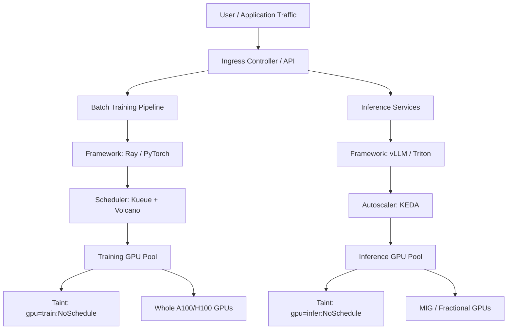
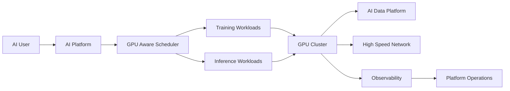

# ADR-002: Enterprise AI/ML Infrastructure on Kubernetes (Training vs Inference GPU Strategy)

## Status
Proposed

## Context
Enterprise AI platforms on Kubernetes must support two workload classes with very different runtime behavior:

- **Training workloads** are long-running, throughput-oriented, and often distributed across multiple GPUs.
- **Inference workloads** are latency-sensitive, bursty, and require fast autoscaling.

The core design challenge is how to separate and share expensive GPU resources safely between these workload classes while preserving training SLAs and inference latency objectives.

## Functional Requirements
- Schedule distributed training jobs without partial placement deadlocks.
- Guarantee low-latency inference performance under burst traffic.
- Isolate noisy-neighbor effects between batch and online serving.
- Support efficient GPU utilization, including fractional GPU usage for inference.
- Provide a controlled mechanism to borrow idle training GPUs for lower-priority workloads.

## Non-Functional Requirements
- High GPU utilization while maintaining workload isolation boundaries.
- Predictable training start times and completion reliability.
- P95/P99 inference latency protection during traffic spikes.
- Production-grade observability for GPU health and saturation.
- Security and governance controls for multi-tenant AI teams.

## Decision (Selected High-Level Design)
Adopt a dual-pool GPU architecture with policy-driven borrowing:

- **Training GPU Pool** uses dedicated nodes and whole GPUs for deterministic performance.
- **Inference GPU Pool** uses MIG/time-slicing for higher density and elasticity.
- **Admission and scheduling controls** (Kueue + Volcano + scheduler plugins) enforce placement intent and gang scheduling.
- **Priority-based preemption** allows temporary borrowing of idle training capacity by lower-priority inference/dev workloads.

## Architecture Overview

## Core System Components

| Layer | Component | Function and Strategy |
|---|---|---|
| Ingestion and Admission | Kueue / Volcano | Queue incoming training jobs and enforce gang scheduling (all-or-nothing placement) for distributed training. |
| Compute Isolation | Node Pools and Taints | Separate physical node pools via taints/tolerations so long-running training does not degrade latency-sensitive inference APIs. |
| GPU Slicing | NVIDIA MIG / MPS | Partition large GPUs into hardware-isolated slices for inference microservices to improve utilization. |
| Observability | NVIDIA DCGM Exporter | Export GPU temperature, memory bandwidth, and utilization to Prometheus and Grafana for SLO tracking. |

## High-Level Flow

## Detailed Design

```mermaid
flowchart TB
    %% Users
    A[Users / Data Scientists / Applications]
    B[AI API Clients]

    %% Entry Layer
    A --> C[AI Platform Portal]
    B --> D[API Gateway / Inference Gateway]

    %% Platform Control Plane
    C --> E[Kubernetes Control Plane]
    D --> E

    subgraph Kubernetes_Cluster [Kubernetes Cluster]
        E --> F[AI Scheduler Layer]

        %% Scheduling
        subgraph Scheduling
            F --> F1[Volcano Scheduler<br/>Gang Scheduling]
            F --> F2[Kueue<br/>Queue Management]
            F --> F3[Kubernetes Scheduler Plugins<br/>GPU/NUMA/Topology Aware]
        end

        %% Workload Orchestration
        subgraph AI_Workload_Orchestration [AI Workload Orchestration]
            G[Argo Workflows]
            H[Kubeflow Pipelines]
            I[Ray Cluster Operator]
            J[PyTorch Operator]
        end

        F --> G
        F --> H
        F --> I
        F --> J

        %% Workload Types
        subgraph AI_Workloads [AI Workloads]
            K[Model Training Jobs]
            L[Distributed Training<br/>PyTorch DDP/FSDP]
            M[LLM Fine Tuning]
            N[Batch Inference]
            O[Real-time Model Serving]
        end

        G --> K
        H --> M
        I --> L
        J --> L
        D --> O

        %% GPU Layer
        subgraph GPU_Infrastructure [GPU Infrastructure]
            P[NVIDIA GPU Operator]
            Q[GPU Device Plugin]
            R[NVIDIA DCGM Exporter]
            S[MIG Manager<br/>GPU Partitioning]
            T[NVIDIA Runtime<br/>CUDA]
        end

        K --> P
        L --> P
        M --> P
        O --> P

        P --> Q
        P --> R
        P --> S
        P --> T

        %% Compute Nodes
        subgraph Compute_Layer [Compute Layer]
            U1[GPU Node Pool<br/>H100/A100/L40]
            U2[CPU Node Pool]
            U3[Memory Optimized Nodes]
        end

        P --> U1
        G --> U2
        H --> U3

        %% GPU Isolation
        subgraph Resource_Isolation [Resource Isolation]
            V1[MIG GPU Partitioning]
            V2[GPU Time Sharing]
            V3[Kubernetes ResourceQuota]
            V4[Namespaces]
            V5[RBAC Policies]
        end

        U1 --> V1
        U1 --> V2
        E --> V3
        E --> V4
        E --> V5

        %% Networking
        subgraph High_Performance_Network [High Performance Network]
            W1[Cilium / Calico CNI]
            W2[RDMA]
            W3[InfiniBand / RoCE]
            W4[GPUDirect RDMA]
            W5[NVLink / NVSwitch]
        end

        U1 --> W1
        U1 --> W2
        U1 --> W3
        U1 --> W4
        U1 --> W5

        %% Storage
        subgraph AI_Data_Platform [AI Data Platform]
            X1[Object Storage<br/>S3/GCS/MinIO]
            X2[Distributed FS<br/>Lustre/CephFS]
            X3[Local NVMe Cache]
            X4[Model Registry]
        end

        K --> X1
        L --> X2
        M --> X3
        O --> X4

        %% Autoscaling
        subgraph Scaling
            Y1[Karpenter]
            Y2[Cluster Autoscaler]
            Y3[KEDA]
        end

        E --> Y1
        E --> Y2
        E --> Y3

        %% Observability
        subgraph Observability
            Z1[OpenTelemetry Collector]
            Z2[Prometheus]
            Z3[Grafana]
            Z4[Loki Logs]
            Z5[Jaeger Tracing]
        end

        R --> Z2
        E --> Z1
        Z1 --> Z5
        Z2 --> Z3
        Z4 --> Z3

        %% Security
        subgraph Security
            AA1[Admission Controller<br/>OPA Gatekeeper/Kyverno]
            AA2[Secrets Manager]
            AA3[Network Policies]
            AA4[Image Security Scanner]
        end

        E --> AA1
        E --> AA2
        E --> AA3
        E --> AA4
    end
```

## Interview Framing: Trade-Offs

### 1) Dedicated Node Pools (Safest / Highest Performance)
**Pros**
- Strong compute and memory isolation.
- Minimal noisy-neighbor risk for inference SLOs.
- Simpler operational blast-radius boundaries.

**Cons**
- Lower aggregate GPU utilization.
- Higher infrastructure cost.

### 2) GPU Sharing with MIG (Cost-Optimized / High Efficiency)
**Pros**
- Higher utilization of premium GPUs (A100/H100).
- Better fit for small, bursty inference workloads.
- Hardware-isolated fractional instances.

**Cons**
- Requires Ampere-or-newer GPU support.
- Added provisioning and capacity-planning complexity.

## Next-Step Practice: Borrowing Idle Training GPUs Safely

If training utilization drops (for example, to 30% overnight), use controlled opportunistic scheduling:

1. Define **PriorityClasses**:
   - `training-priority` (high)
   - `dev-inference-priority` (low)
2. Allow low-priority pods to run on training pools using tolerated taints only during policy-approved windows.
3. Enable **scheduler preemption** so high-priority training jobs evict low-priority pods immediately when demand returns.
4. Add guardrails:
   - Queue-level quotas in Kueue
   - PodDisruptionBudgets for critical inference services
   - Time-based admission policy (Kyverno/Gatekeeper)
5. Track reclaim behavior and SLA impact via Prometheus metrics and alerting.

This provides cost-efficient GPU borrowing without violating training SLAs.
