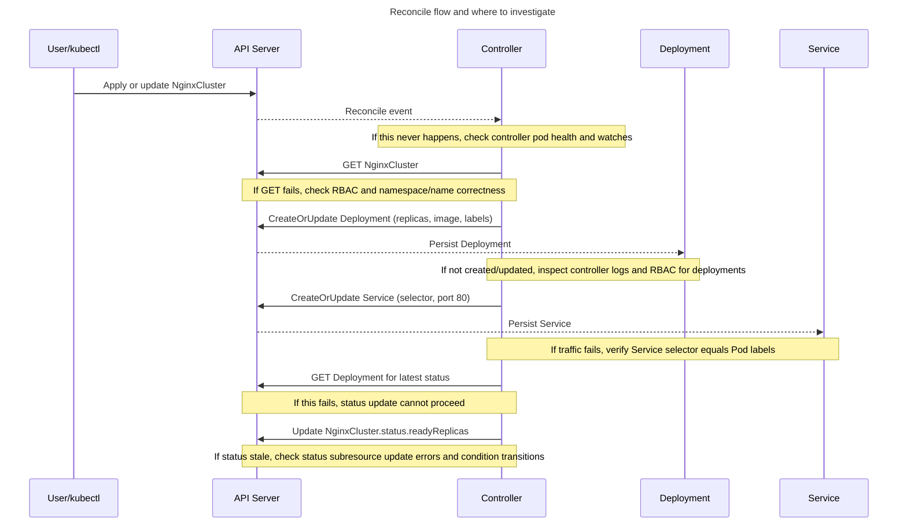

# ADR-003: NGINX Operator Design Q&A

This document has all questions with a short answer first, then how to verify.

### Q1: If a CR spec change takes 10+ minutes to take effect, what all should we look for?
**Answer:** Treat this as a control-loop latency issue and debug in layers: trigger, controller, child resources, and cluster/runtime.

**What to check first (in order)**
1. **Trigger and pickup**
   - Did `metadata.generation` increment after spec change?
   - Did controller logs show reconcile for that CR/generation?
2. **Status progression**
   - Is `status.readyReplicas` changing?
   - Are `Available` / `Progressing` / `Degraded` conditions moving?
3. **Child resource rollout**
   - Deployment desired vs ready replicas.
   - Pod states (`Pending`, `ImagePullBackOff`, probe failures, scheduling/quotas).
4. **Controller health/performance**
   - Reconcile errors, status update conflicts, retry/backoff loops.
5. **Platform bottlenecks**
   - RBAC denials, API throttling, webhook delays, node pressure.

**Commands I would ask the team to run**
```bash
# CR and status/conditions
kubectl get nginxcluster <name> -n <namespace> -o yaml
kubectl describe nginxcluster <name> -n <namespace>
kubectl get nginxcluster <name> -n <namespace> -o jsonpath='{.metadata.generation}{"\n"}{.status.readyReplicas}{"\n"}'
kubectl get nginxcluster <name> -n <namespace> -o jsonpath='{range .status.conditions[*]}{.type}={.status} ({.reason}){"\n"}{end}'

# Child resources and pods
kubectl get deploy <name> -n <namespace> -o wide
kubectl describe deploy <name> -n <namespace>
kubectl get pods -n <namespace> -l app=<name>
kubectl describe pod <pod-name> -n <namespace>

# Operator logs and events
kubectl logs -n nginx-operator-system deployment/nginx-operator-controller-manager -c manager --since=15m
kubectl get events -n <namespace> --sort-by=.metadata.creationTimestamp
```

**Interview design point**
- In production, define an SLO (for example, spec-change-to-ready under 10 minutes), expose reconcile latency metrics, and set a timeout condition/event (`ReconcileTimeout`) when the SLO is breached.

### Q2: What does this operator do?
**Answer:** For each `NginxCluster`, it reconciles one `Deployment` and one `Service` (both with the same name as the CR, in the same namespace).

**How to verify**
```bash
kubectl get nginxcluster <name> -n <namespace>
kubectl get deploy <name> -n <namespace>
kubectl get svc <name> -n <namespace>
```

### Q3: How does scaling work?
**Answer:** `NginxCluster.spec.replicas` is copied to `Deployment.spec.replicas`.

**How to verify**
```bash
kubectl get nginxcluster <name> -n <namespace> -o jsonpath='{.spec.replicas}{"\n"}'
kubectl get deploy <name> -n <namespace> -o jsonpath='{.spec.replicas}{"\n"}'
```

### Q4: Which nginx image runs?
**Answer:** The controller currently sets image to `nginx:1.27` (hardcoded).

**How to verify**
```bash
kubectl get deploy <name> -n <namespace> -o jsonpath='{.spec.template.spec.containers[0].image}{"\n"}'
```

### Q5: How are resources cleaned up when CR is deleted?
**Answer:** `Deployment` and `Service` are owner-referenced to `NginxCluster`, so Kubernetes garbage collection removes them.

**How to verify**
```bash
kubectl get deploy <name> -n <namespace> -o yaml | rg ownerReferences -n
kubectl get svc <name> -n <namespace> -o yaml | rg ownerReferences -n
```

### Q6: What status does operator update?
**Answer:** It updates:

- `status.readyReplicas` from `Deployment.status.readyReplicas`
- `status.conditions`:
  - `Available`
  - `Progressing`
  - `Degraded`

**How to verify**
```bash
kubectl get nginxcluster <name> -n <namespace> -o jsonpath='{.status.readyReplicas}{"\n"}'
kubectl get deploy <name> -n <namespace> -o jsonpath='{.status.readyReplicas}{"\n"}'
kubectl get nginxcluster <name> -n <namespace> -o jsonpath='{.status.conditions[*].type}{"\n"}'
kubectl get nginxcluster <name> -n <namespace> -o jsonpath='{.status.conditions[*].status}{"\n"}'
```

### Q7: What happens when `spec.replicas=0`?
**Answer:** Current logic marks `Available=False` when desired replicas are `0`, even if `readyReplicas=0`.  
This is expected from current implementation (`desiredReplicas > 0` is required for `Available=True`).

**How to verify**
```bash
kubectl patch nginxcluster <name> -n <namespace> --type merge -p '{"spec":{"replicas":0}}'
kubectl get nginxcluster <name> -n <namespace> -o jsonpath='{.status.conditions[?(@.type=="Available")].status}{"\n"}'
kubectl get nginxcluster <name> -n <namespace> -o jsonpath='{.status.conditions[?(@.type=="Progressing")].status}{"\n"}'
```

### Q8: What triggers reconciliation?
**Answer:** Changes to `NginxCluster`, and changes to owned `Deployment`/`Service`.

**How to verify**
- Update CR replicas and watch controller logs
- Modify Deployment manually and confirm a reconcile loop runs

## Sequence Diagram With Investigation Notes



## Investigation Playbook (Fast Path)

### 1) Check CR and events first
```bash
kubectl describe nginxcluster <name> -n <namespace>
kubectl get nginxcluster <name> -n <namespace> -o yaml
```
Look for:
- wrong/missing `spec.replicas`
- no `status.readyReplicas` updates
- warning events

### 2) Check managed resources
```bash
kubectl describe deploy <name> -n <namespace>
kubectl get svc <name> -n <namespace> -o yaml
```
Look for:
- Deployment desired vs ready mismatch
- Service selector mismatch

### 2.1) Check computed conditions explicitly
```bash
kubectl get nginxcluster <name> -n <namespace> -o jsonpath='{range .status.conditions[*]}{.type}={.status} ({.reason}){"\n"}{end}'
```
Look for:
- `Available=True` only when desired replicas are ready and desired > 0
- `Progressing=True` while converging
- `Degraded=False` in normal path

### 3) Check Pods when ready replicas are low
```bash
kubectl get pods -n <namespace> -l app=<name>
kubectl describe pod <pod-name> -n <namespace>
kubectl logs <pod-name> -n <namespace>
```
Look for:
- image pull errors
- probe failures
- scheduling/quotas

### 4) Check controller logs
```bash
kubectl logs -n nginx-operator-system deployment/nginx-operator-controller-manager -c manager -f
```
If running locally:
```bash
make run
```
Look for:
- reconcile errors for Deployment/Service create-update
- status update conflicts/errors

### 5) Check RBAC and CRD
```bash
kubectl auth can-i create deployments --as system:serviceaccount:nginx-operator-system:nginx-operator-controller-manager -n <namespace>
kubectl get crd nginxclusters.platform.example.com
```

## Quick Symptom -> Cause Map

- **CR present, no Deployment/Service** -> controller not running, watch not firing, or RBAC denied
- **Deployment exists, not ready** -> image/probe/scheduling issues
- **Service exists, app unreachable** -> selector-label mismatch or pods not ready
- **Status not changing** -> status update failing or reconcile not re-triggering
