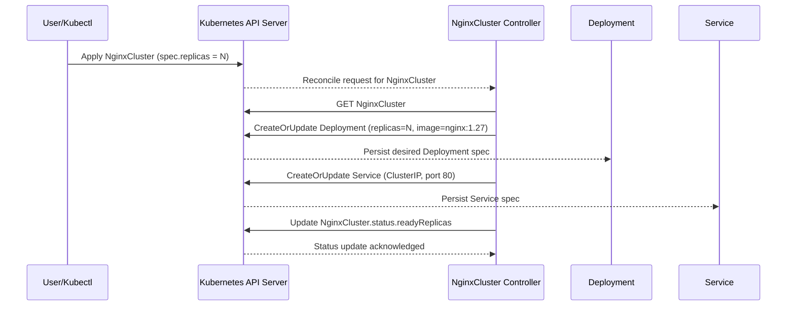

# NGINX Operator Design Q&A

This document captures common design questions, the current behavior of the operator, and a practical investigation workflow for debugging issues.

## Key Questions and Answers

### 1) What does this operator create from a `NginxCluster` custom resource?

For each `NginxCluster`, the controller reconciles:

- a `Deployment` named the same as the CR
- a `Service` (`ClusterIP`) named the same as the CR

Both resources are created in the same namespace as the custom resource.

### 2) How is scale handled?

`spec.replicas` from `NginxCluster` is applied directly to `Deployment.spec.replicas`.

### 3) Which image is deployed?

The managed pod runs `nginx:1.27` currently.

### 4) How is ownership and cleanup handled?

The controller sets owner references from `Deployment` and `Service` to the `NginxCluster`.  
When the CR is deleted, Kubernetes garbage collection can remove owned resources.

### 5) What status is reported back to the custom resource?

The controller updates:

- `status.readyReplicas` from `Deployment.status.readyReplicas`

### 6) What resources/events trigger reconciliation?

The controller watches:

- `NginxCluster`
- owned `Deployment`
- owned `Service`

## Reconciliation Sequence Diagram



## How to Investigate an Issue

Use this checklist to debug reconcile or runtime issues quickly.

### Step 1: Validate the custom resource

```bash
kubectl get nginxclusters.platform.example.com -A
kubectl describe nginxcluster <name> -n <namespace>
kubectl get nginxcluster <name> -n <namespace> -o yaml
```

Check:

- `spec.replicas` value is set as expected
- `status.readyReplicas` progression
- warning events on the resource

### Step 2: Inspect managed Deployment and Service

```bash
kubectl get deploy <name> -n <namespace> -o wide
kubectl describe deploy <name> -n <namespace>
kubectl get svc <name> -n <namespace> -o yaml
```

Check:

- Deployment replica counts (desired/current/ready)
- Pod template uses `nginx:1.27`
- Service selector matches pod labels

### Step 3: Inspect Pods for runtime failures

```bash
kubectl get pods -n <namespace> -l app=<name>
kubectl describe pod <pod-name> -n <namespace>
kubectl logs <pod-name> -n <namespace>
```

Check:

- image pull failures
- scheduling/resource issues
- readiness probe failures

### Step 4: Inspect controller logs

If deployed in cluster:

```bash
kubectl logs -n nginx-operator-system deployment/nginx-operator-controller-manager -c manager -f
```

If running locally:

```bash
make run
```

Then re-apply/update the CR and observe reconcile log lines and errors.

### Step 5: Verify RBAC and CRD state

```bash
kubectl auth can-i create deployments --as system:serviceaccount:nginx-operator-system:nginx-operator-controller-manager -n <namespace>
kubectl get crd nginxclusters.platform.example.com
```

Check:

- controller service account has required permissions
- CRD is installed and up-to-date

### Step 6: Reproduce with tests

```bash
make test
make test-e2e
```

Use unit/integration tests first, then e2e in an isolated Kind cluster for full flow validation.

## Common Failure Patterns

- CR exists, but no child resources -> controller not running, RBAC failure, or watch setup issue
- Deployment created, but not ready -> image pull, readiness probe, scheduling, or quota issues
- Service exists, but no traffic -> label/selector mismatch or pod readiness not reached
- Status not updating -> status update conflict/error or stale reconcile object

## Suggested Next Enhancements

- Add `metav1.Condition` updates (Ready/Progressing/Degraded) for richer status
- Make image configurable in `spec` instead of hardcoded `nginx:1.27`
- Add explicit Events for create/update/error transitions
- Add failure-oriented tests for reconcile error paths
