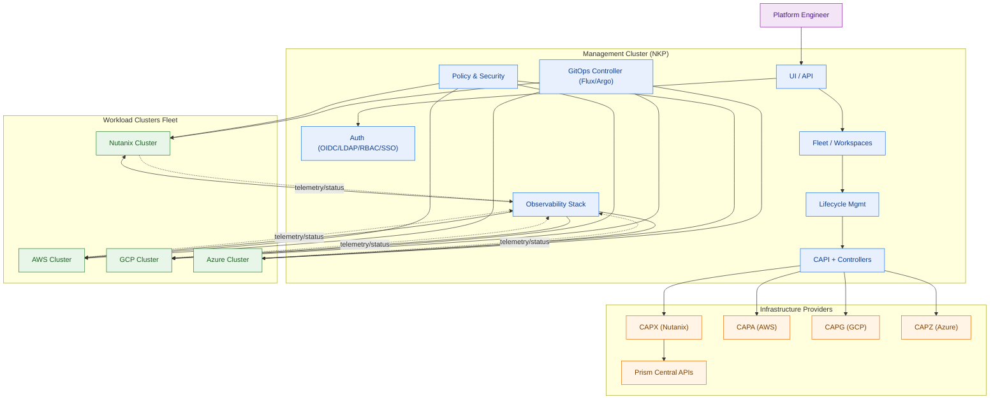

# ADR-004: Nutanix NKP Platform Architecture

## Status
Proposed

## Context
Reference architecture for running Kubernetes clusters with a management-plane-first design and Cluster API lifecycle operations.

## Architecture Diagram

## Propagation Model

### Policy and Security to Workload Clusters

- Management defines baseline policy bundles and guardrails
- GitOps applies policy manifests into each workload cluster
- Cluster-local policy engines enforce continuously
- Compliance and drift status is aggregated back to management

### Observability to Workload Clusters

- Management defines a standard telemetry package
- GitOps deploys telemetry agents/collectors to each workload cluster
- Cluster-local collectors ship metrics, logs, and traces to central backends
- Central dashboards and alerting provide fleet-wide visibility

## Design Notes

- Management-first control model for provisioning and day-2 operations
- CAPI as declarative lifecycle API for create/scale/upgrade/repair
- Provider-specific infrastructure adapters under a common control pattern
- Parallel workload subsystems with consistent policy and telemetry controls
