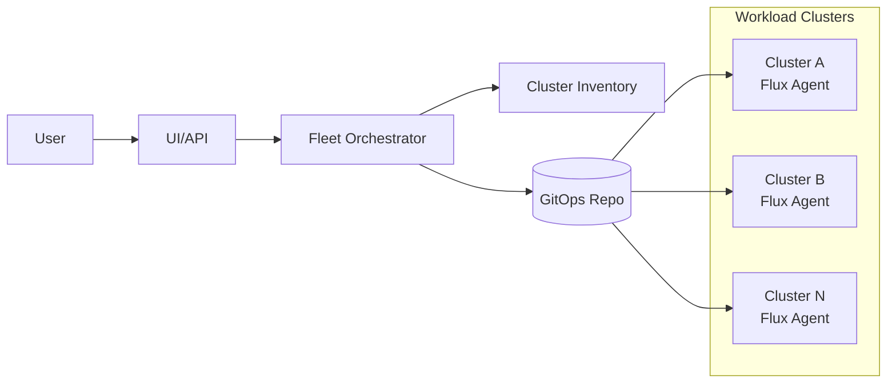

# ADR-001: Fleet Application Deployment Platform (GitOps Pull Model)

## Status
Proposed

## Context
We need one-click deployment of an application to hundreds/thousands of Kubernetes clusters across AWS, GCP, and on-prem.
We have one management cluster and many workload clusters, and we need scale, safety, and auditability.

## Decision
Use a **GitOps pull model**:

- Management plane (UI/API + orchestrator) creates and publishes desired state
- Each workload cluster runs a controller/agent (for example Flux) that pulls and reconciles locally
- Rollout uses canary/waves with health gates, pause, and rollback
- Status is aggregated back to management for fleet visibility

## High-Level Architecture

## Rollout Policy (Example)

- Canary: 1-5 clusters
- Wave 1: 5%
- Wave 2: 20%
- Wave 3: 50%
- Wave 4: 100%
- Stop/rollback on health gate failure

## Notes

This page is the wiki mirror of the richer source document:
`docs/fleet-application-deployment-wiki.md`.
