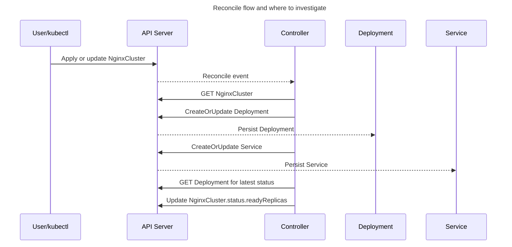

# ADR-003: NGINX Operator Design Q&A

## Status
Proposed

## Context
This ADR captures practical operator behavior and troubleshooting guidance using this `nginx-operator` implementation.

## Q1: If a CR spec change takes 10+ minutes to take effect, what should we look for?

**Answer:** Treat this as a control-loop latency issue and debug in layers: trigger, controller, child resources, and cluster/runtime.

### What to check first (in order)

1. **Trigger and pickup**
   - Did `metadata.generation` increment after spec change?
   - Did controller logs show reconcile for that CR/generation?
2. **Status progression**
   - Is `status.readyReplicas` changing?
   - Are `Available` / `Progressing` / `Degraded` conditions moving?
3. **Child resource rollout**
   - Deployment desired vs ready replicas
   - Pod states (`Pending`, `ImagePullBackOff`, probe failures, scheduling/quotas)
4. **Controller health/performance**
   - Reconcile errors, status update conflicts, retry/backoff loops
5. **Platform bottlenecks**
   - RBAC denials, API throttling, webhook delays, node pressure

## Sequence Diagram

## Notes

This page mirrors and condenses:
`docs/wiki-operator-design-qna.md` and `docs/operator-design-qna.md`.
